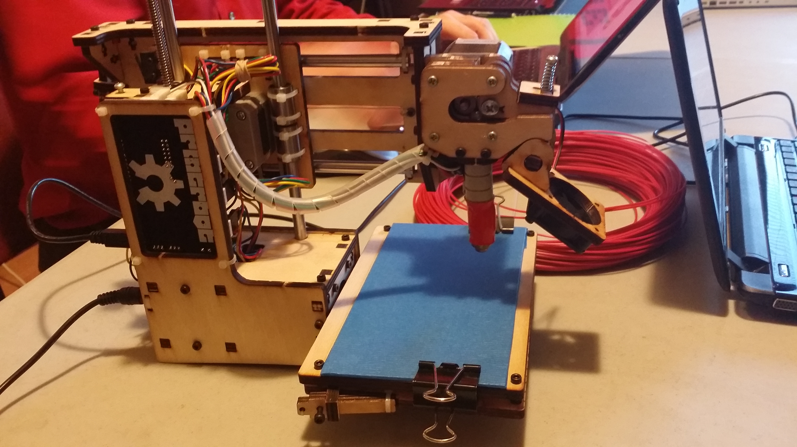
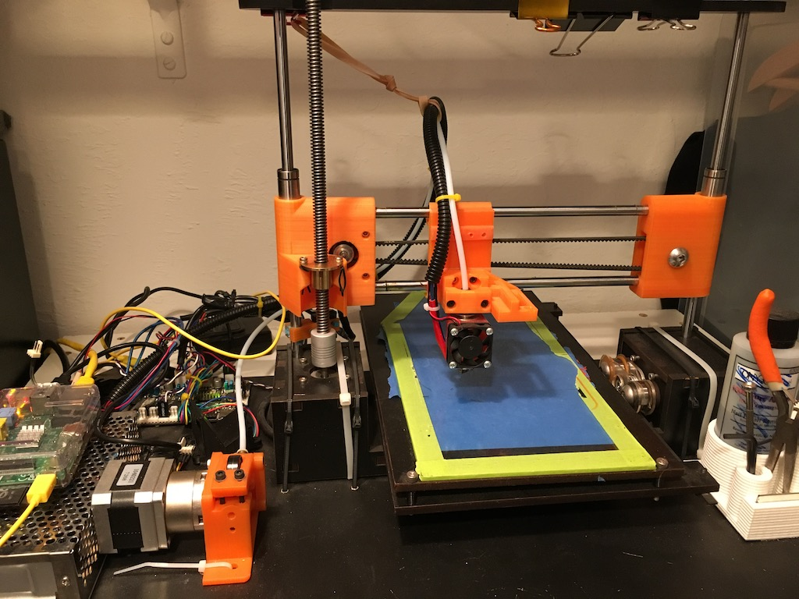

---
# site organizational properties. don't change this
layout: project
featured: true
sort-order: 90

# modify these to be specific to your project
# mandatory
title: 3D Printing

# optional - if not used, comment out using '#'
hackers: [Kevin Conner, Seth Morgan, Pat Cunningham]
# date: 
# abstract: 
keywords: [3D Printing, Hardware, Open Source]
thumbnail: feature-photo.jpg
# link:

---

Many members of Rogue Hack Lab use and have built 3D printers. Collectively mastering this process is an ongoing project that we engage in at nearly every oportunity.

<!-- more -->

## What is 3d printing?

3D printing is a manufacturing process where plastic is melted and fused through a number of methods in order to additively replicate a CAD model.

| Member Printer Gallary					| Type           | Owner  |
| -----------------------------------------	| -------------| ----- |
|  | Printr Bot | Kevin |
|  | centered      |   Seth |
|  | QUBD 2 Up     | Hack Lab |