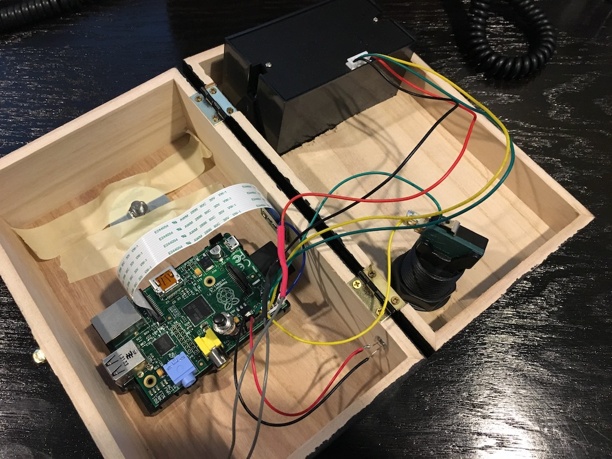

---
# site organizational properties. don't change this
layout: project
featured: false
sort-order: 90

# modify these to be specific to your project
# mandatory
title: Photo Booth

# optional - if not used, comment out using '#' (i.e. date:)
hackers: [Your Name, Other Name, Another Name]
# date:
# abstract:
keywords: [Javascript, Web Design, Raspberry Pi]
thumbnail: IMG_0005.PNG
link: roguehacklab.com/photobooth

---

Using a [RaspberryPi](http://RaspberryPi.org), camera module, thermal printer and a switch we created a photobooth that will take pictures, upload them to the internet and then allow participants to download the pictures later.
<!-- more -->

__Had your photo taken? [Access your picture here](http://roguehacklab.com/photobooth/).__

## How its made

The majority of the setup is following this [Adafruit Guide](https://learn.adafruit.com/instant-camera-using-raspberry-pi-and-thermal-printer) with some [custom scripts](https://github.com/rogue-hack-lab/photobooth).

